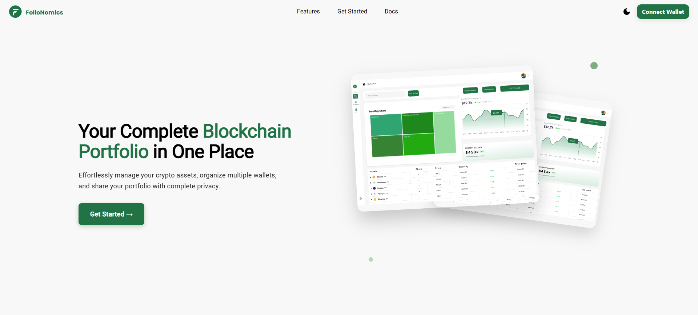
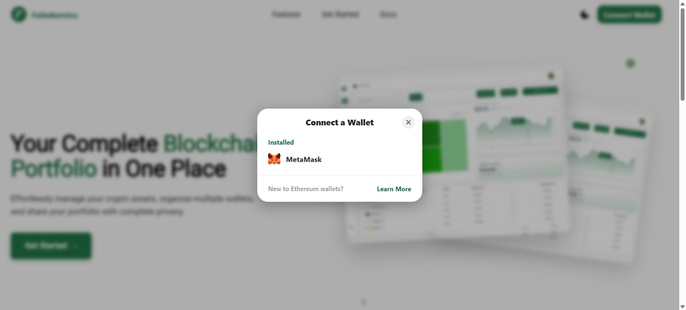
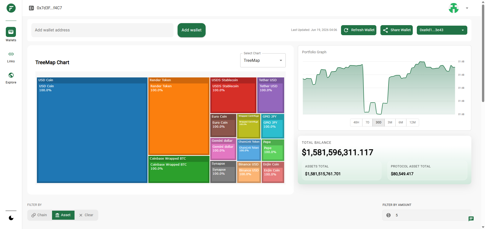
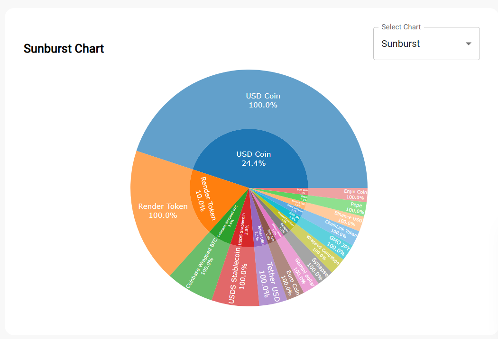
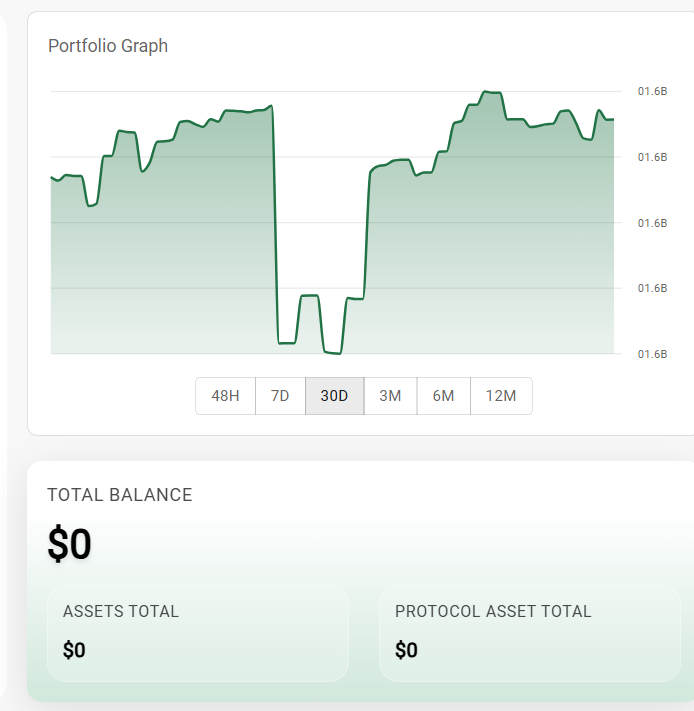
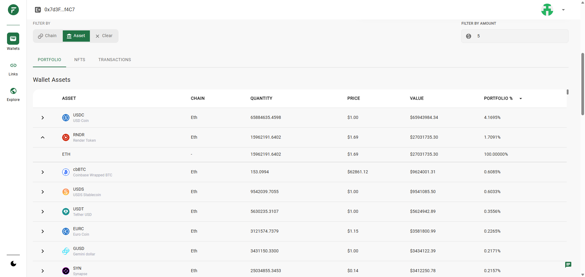
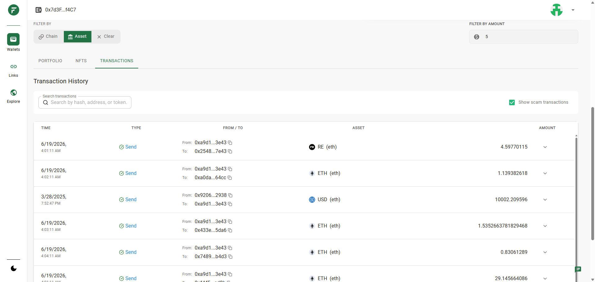
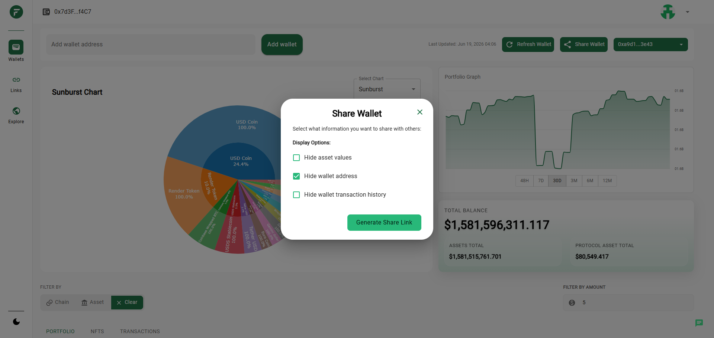
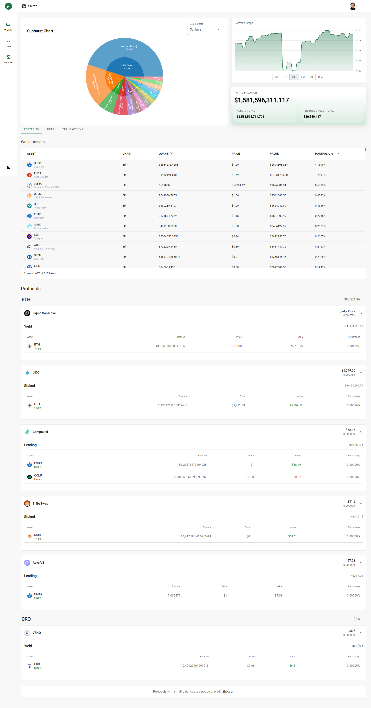
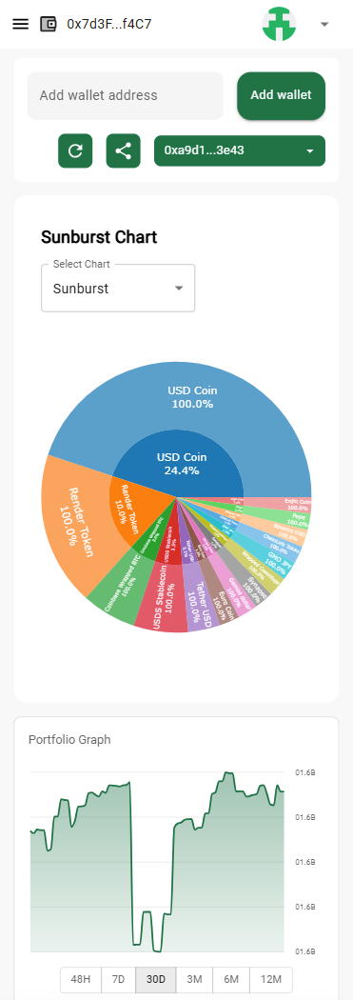

# Folionomics — Crypto Portfolio Management Dashboard Case Study

A public proof-of-work case study for a responsive Web3 portfolio dashboard built with **Next.js, React, TypeScript, Redux Toolkit, Material UI, Wagmi, Viem, RainbowKit, Solana Web3.js, and data visualization components**.

This case study demonstrates how a modern Web3 frontend can connect wallet authentication, multi-address portfolio management, wallet bundles, assets, protocols, NFTs, transactions, historical value charts, public discovery, and privacy-controlled share links.

> This repository is a public case study. It does not expose private source code, API credentials, environment values, real wallet data, customer records, production API responses, private infrastructure addresses, or confidential business information.

---

## Source Code & Review Scope

The full production codebase for this project is private and is not included in this public repository.

This repository contains a sanitized proof-of-work case study based on the local project implementation, verified feature review, architecture notes, public-safe screenshots, and selected safe code samples.

The purpose of this repository is to demonstrate frontend architecture, Web3 wallet integration, Redux-based domain state, dashboard design, sharing/privacy workflows, data visualization, and product engineering approach without exposing private production code or real wallet/customer data.

---

## Project Overview

**Folionomics** is a responsive Web3 portfolio dashboard for aggregating and exploring blockchain holdings in one interface.

The product lets users:

* Connect a wallet
* Register additional wallet addresses
* Group wallet addresses into bundles
* Inspect assets, protocols, NFTs, transactions, and portfolio history
* View portfolio allocation charts
* Manage wallet and bundle selections
* Generate privacy-controlled public views
* Browse public wallet views
* Manage profile, share links, credits, and related account workflows

The frontend combines wallet connectivity, authenticated and public REST API workflows, Redux Toolkit domain state, reusable dashboard components, charts, tables, dialogs, privacy states, loading states, empty states, error states, and responsive Material UI layouts.

---

## Case Study Highlights

| Area                      | Proof                                                                          |
| ------------------------- | ------------------------------------------------------------------------------ |
| Product Type              | Web3 crypto portfolio dashboard                                                |
| Frontend                  | Next.js 14 App Router, React 18, TypeScript                                    |
| Web3                      | Wagmi, Viem, RainbowKit, Ethereum, ENS, Solana Web3.js, `.sol` resolution      |
| State Management          | Redux Toolkit, React Redux, async thunks, selectors, domain slices             |
| Dashboard UI              | Portfolio totals, assets, protocols, NFTs, transactions, history, charts       |
| Data Visualization        | Plotly treemap/sunburst, Recharts historical charts                            |
| Privacy                   | Share links with value, address, and transaction visibility controls           |
| Deployment-Oriented Build | Docker, standalone Next.js output, AWS-oriented build/deployment configuration |

---

## Product Walkthrough

The screenshots below should use **synthetic, demo, or fully redacted data only**. Never publish real wallet addresses, balances, transaction hashes, QR codes, API responses, backend URLs, tokens, or customer information.

### 1. Landing & Wallet Entry

| Landing Page                                                                                | Wallet Connect                                                                            |
| ------------------------------------------------------------------------------------------- | ----------------------------------------------------------------------------------------- |
|  |  |

**What this shows:** Product onboarding, marketing entry point, wallet connection, theme support, and initial user journey.

---

### 2. Portfolio Dashboard



**What this shows:** Main dashboard experience with wallet or bundle context, portfolio totals, holdings overview, charts, filters, and reusable dashboard layout.

---

### 3. Portfolio Allocation & History

| Allocation Visualization                                                                          | Historical Value Chart                                                                               |
| ------------------------------------------------------------------------------------------------- | ---------------------------------------------------------------------------------------------------- |
|  |  |

**What this shows:** Treemap/sunburst allocation views and historical value analysis with selectable time periods.

---

### 4. Assets, Protocols, NFTs & Transactions

| Asset Table                                                                   | Transaction History                                                                           |
| ----------------------------------------------------------------------------- | --------------------------------------------------------------------------------------------- |
|  |  |

**What this shows:** Data-heavy portfolio UI with tables, filters, expandable rows, copy actions, loading states, and privacy-aware presentation.

---

### 5. Share Links & Public Views

| Share Settings                                                                            | Public Portfolio View                                                                   |
| ----------------------------------------------------------------------------------------- | --------------------------------------------------------------------------------------- |
|  |  |

**What this shows:** Privacy-controlled portfolio sharing with options to hide values, addresses, and transaction history.

---

### 6. Mobile Dashboard



**What this shows:** Responsive Web3 portfolio experience across mobile and desktop screens.

---

## Business Problem

Crypto users often hold assets across multiple wallets, addresses, chains, protocols, and NFT collections. Reviewing those holdings separately makes it difficult to understand:

* Total portfolio exposure
* Asset distribution
* Chain allocation
* Protocol positions
* NFT holdings
* Transaction history
* Portfolio movement over time
* What can safely be shared publicly

Folionomics addresses this by providing a consolidated dashboard for wallets and wallet bundles, visual breakdowns, searchable tables, history charts, public discovery, and privacy-controlled sharing.

Commercial outcomes, user counts, conversion rates, revenue, and measured performance improvements are not claimed in this public case study.

---

## My Role

**Role:** Senior Frontend Engineer — React, Next.js & Web3

My responsibilities included:

* Building a production-oriented Next.js and TypeScript frontend
* Implementing wallet-connected dashboard experiences
* Integrating EVM wallet connection through Wagmi, Viem, and RainbowKit
* Supporting Ethereum, Bitcoin, and Solana address workflows, including ENS and `.sol` name resolution
* Integrating authenticated and public REST API workflows
* Modeling wallet, bundle, asset, protocol, NFT, transaction, graph, user, and share-link domains in Redux Toolkit
* Building responsive dashboards, tables, filters, dialogs, forms, charts, and reusable UI states
* Implementing wallet and bundle switching, refresh workflows, and persisted user selections
* Supporting expiring, revocable, extendable, privacy-controlled share links and QR-code sharing
* Adding loading skeletons, empty states, error feedback, retry states, and input validation
* Supporting containerized build/deployment-oriented frontend configuration

This case study does not claim sole ownership, backend ownership, smart-contract ownership, data-provider ownership, or production operations ownership.

---

## Tech Stack

| Area               | Technology                                                             |
| ------------------ | ---------------------------------------------------------------------- |
| Frontend Framework | Next.js 14 App Router                                                  |
| UI Library         | React 18                                                               |
| Language           | TypeScript                                                             |
| State Management   | Redux Toolkit, React Redux                                             |
| Context            | Wallet Context, Theme Context                                          |
| UI System          | Material UI                                                            |
| Styling            | Emotion, styled-components, Tailwind CSS                               |
| Web3               | Wagmi, Viem, RainbowKit                                                |
| Solana             | Solana Web3.js, Bonfida SPL Name Service                               |
| Data Visualization | Plotly / react-plotly.js, Recharts                                     |
| API Layer          | Custom fetch wrapper, REST APIs                                        |
| QR Codes           | QRCode                                                                 |
| Utilities          | CryptoJS SHA-256, date-fns                                             |
| Testing            | Jest, React Testing Library                                            |
| Build / Deployment | Docker, Next.js standalone output, AWS-oriented config, GitHub Actions |

---

## System Architecture

```text
folionomics-web3-dashboard-case-study/
├── README.md
├── screenshots/
│   ├── 01-landing-page.png
│   ├── 02-wallet-connect.png
│   ├── 03-portfolio-dashboard.png
│   ├── 04-allocation-chart.png
│   ├── 05-history-chart.png
│   ├── 06-asset-table.png
│   ├── 07-transaction-history.png
│   ├── 08-share-settings.png
│   ├── 09-public-view.png
│   └── 10-mobile-dashboard.png
├── architecture/
│   ├── system-overview.md
│   ├── provider-architecture.md
│   ├── state-management.md
│   └── sharing-privacy-flow.md
├── docs/
│   ├── verified-tech-stack.md
│   ├── feature-inventory.md
│   ├── web3-wallet-flows.md
│   ├── performance-security.md
│   └── privacy-redaction-checklist.md
└── code-samples/
    ├── api-client/
    ├── dashboard-tabs/
    ├── wallet-detection/
    ├── share-link-flow/
    └── chart-data-transform/
```

The private implementation uses a feature-oriented Next.js App Router architecture with reusable components, containers, hooks, Redux slices, shared types, Web3 utilities, dashboard views, and provider composition.

---

## Architecture Highlights

* App Router-based routing, layouts, and provider structure
* Redux Toolkit for server-backed business domains and request lifecycle state
* React Context for wallet identity and theme preferences
* Material UI for responsive components, dialogs, tables, navigation, and theming
* Wagmi, Viem, and RainbowKit for EVM wallet connectivity
* Solana Web3.js and Bonfida SPL Name Service for Solana workflows
* Reusable dashboard sections for balances, assets, protocols, NFTs, transactions, and graphs
* Data-adapter approach for public/shared dashboard views
* Centralized API wrapper for JSON handling, bearer authentication, query parameters, abort signals, and normalized HTTP errors
* Deferred loading for heavy charts, NFT/transaction tabs, and viewport-dependent sections

---

## Core Product Features

### Marketing & Onboarding

* Landing page
* Feature explanation
* Onboarding steps
* Responsive navigation
* Theme switching
* Wallet connect entry point

### Wallet Authentication

* RainbowKit wallet connection
* Connected wallet registration with backend
* Access and refresh token lifecycle
* Protected routes
* Wallet disconnect and session cleanup
* Redirect after logout

### Address & Wallet Management

* Add, rename, list, and delete wallet addresses
* Detect Ethereum, Bitcoin, and Solana address formats
* Resolve ENS names
* Resolve `.sol` domains
* Validate wallet labels
* Reject duplicate or invalid entries
* Persist and restore selected wallet

### Wallet Bundles

* Create, edit, select, refresh, and delete wallet bundles
* Load bundle totals and detailed holdings
* View bundle assets, protocols, NFTs, transactions, and history
* Expand grouped bundle assets and fetch nested details on demand

### Portfolio Dashboard

* Total balance cards
* Asset total cards
* Protocol total cards
* Treemap and sunburst allocation charts
* Historical area chart with multiple time periods
* Grouping and filtering by wallet, asset symbol, and chain
* Configurable minimum-value filtering
* Asset tables with sorting and expandable rows
* Protocol grouping by chain and value threshold
* NFT table/grid views
* Transaction history with search, expandable details, copy actions, status display, gas information, and scam indicators

### Sharing & Public Discovery

* Generate wallet or bundle share links
* Hide dollar values
* Hide wallet addresses
* Hide transaction history
* Time-limited links with expiry
* Copyable public links
* Downloadable QR codes
* Preview, revoke, extend, and delete share links
* Browse personal public wallets and all public wallets
* Reuse dashboard components in public shared-view mode

### Profile, Credits & Subscriptions

* Edit display name, description, avatar, and social links
* Validate avatar type and size before upload
* Display remaining credits
* Select subscription plans
* Request additional feature tokens through authenticated API workflows

Completed payment-processing behavior and payment provider production readiness are not claimed in this case study.

### Portfolio Assistant

* Dashboard chat drawer can send a user question with wallet asset/history context to a backend chat endpoint
* Returned answer is displayed inside the dashboard experience

Model provider, prompt governance, retention policy, and production readiness are not claimed in this case study.

---

## Data, API & State Management

The API layer centralizes network calls.

It supports:

* Configured backend base URL
* HTTP methods
* JSON bodies
* FormData
* Query parameters
* Custom headers
* Abort signals
* Bearer token attachment
* Defensive JSON parsing
* Structured HTTP errors

Redux Toolkit domains include:

* Wallet addresses
* Selected wallet
* Wallet assets and totals
* Bundles
* Bundle assets, protocols, NFTs, transactions, and history
* Portfolios
* Graph data
* NFTs
* Protocols
* Transactions
* Time-series history
* Explore/public wallet data
* Share links
* User/profile/credit data

Most remote workflows use async request lifecycle states such as pending, fulfilled, and rejected.

---

## Web3 & Portfolio Logic

### Wallet and Chain Logic

* Ethereum and Sepolia wagmi configuration
* EVM RPC batching, retry, and fetch caching
* RainbowKit wallet connection UI
* Ethereum, Bitcoin, and Solana address detection
* ENS normalization and resolution
* `.sol` resolution through Solana tooling
* Backend-specific wallet chain grouping

### Portfolio Logic

* Wallet and bundle holdings normalized into reusable asset rows
* Asset values, quantities, percentages, chains, symbols, logos, and wallet origin fields drive tables and charts
* Graph utilities transform hierarchical API data into treemap and sunburst structures
* Historical data is normalized and sorted for time-period charts
* Protocol positions are grouped by chain and sorted by value
* Transaction rows are searched by hash, address, token, and chain
* Scam classification is supported in transaction views where available

### Sharing Privacy

* Share links support wallet and bundle identifiers
* Visibility settings control whether values, addresses, and transaction history are shown
* Links include expiry timestamps
* Management actions include preview, revoke, extend, and delete
* Shared responses adapt into the same dashboard contract used by authenticated views

The exact number of production chains, data providers, pricing sources, and protocol integrations is not claimed in this public case study.

---

## Performance, Reliability & Security

### Performance

* Dynamic imports for selected landing and wallet modules
* Client-side Plotly loading with SSR disabled for heavy chart components
* Viewport-based protocol loading through IntersectionObserver
* Deferred NFT and transaction requests until tabs are opened
* Grouped wallet and bundle dashboard requests
* Debounced share-link search
* Server-side pagination for share-link lists
* Memoized derived data, filtering, sorting, and stable handlers
* Next Image for major static assets
* Standalone Next.js output
* Multi-stage Docker build

### Reliability

* Domain-specific Redux loading and error states
* Structured API error handling
* Skeleton, empty, inline error, snackbar, and retry states
* Refresh workflows for dependent datasets
* Wallet/bundle selection persistence
* Abort signals in selected request paths
* Component-level tests for selected UI behavior

### Security & Privacy

* Centralized bearer authentication in API requests
* Protected route validation
* Token refresh and logout cleanup
* Privacy-aware public share views
* Security headers configured in Next.js

LocalStorage token storage, complete end-to-end type safety, full accessibility audit, broader E2E testing, and production monitoring are not claimed in this public case study.

---

## Business Value

This platform creates value by enabling:

* Consolidated portfolio visibility across wallets and chains
* Faster review of assets, protocols, NFTs, transactions, and history
* Clearer portfolio allocation through charts and tables
* Wallet bundle management for grouped holdings
* Controlled public sharing without exposing all sensitive portfolio data
* Reusable dashboard architecture for additional chains, providers, and account features
* Better product trust through loading, empty, error, retry, and privacy states

Commercial outcomes, revenue, user counts, conversion rates, and measured financial impact are not claimed in this public case study.

---

## Privacy & Redaction

This repository must not include:

* `.env` files
* API keys
* RPC keys
* Backend URLs
* Database URLs
* Bearer tokens
* Refresh tokens
* Production wallet addresses
* Customer wallet data
* Real balances
* Real transaction hashes
* QR codes connected to real links
* Real share links
* Customer profiles
* API responses
* Private infrastructure addresses
* Payment credentials
* Production secrets

All screenshots, documentation, and code samples should be reviewed before publishing to make sure no private production data, credentials, wallet data, customer information, or confidential business details are exposed.

---

## Safe Public Code Samples

This public case study may include sanitized examples such as:

* API client wrapper
* Wallet address detection helper
* ENS and `.sol` resolution helper
* Dashboard tab orchestration hook
* Shared-view data adapter
* Share-link privacy flow
* Chart data transformation utility
* Loading skeleton component
* Empty state component
* TypeScript domain models for wallets, assets, protocols, transactions, bundles, and share settings

The purpose of these samples is to demonstrate engineering approach, architecture, and Web3 product thinking without exposing private production code.

---

## Suggested GitHub Repository Description

```text
Web3 crypto portfolio dashboard case study built with Next.js, TypeScript, Redux Toolkit, Material UI, Wagmi, Viem, RainbowKit, portfolio charts, wallet bundles, sharing privacy, and responsive dashboard UI.
```

## Suggested GitHub Topics

```text
nextjs
react
typescript
web3
wagmi
viem
rainbowkit
redux-toolkit
material-ui
crypto-dashboard
portfolio-tracker
data-visualization
recharts
plotly
wallet-connect
case-study
proof-of-work
```

---

## Contact

**Muhammad Shiraz**
Senior Frontend Engineer
React.js | Next.js | TypeScript | React Native | Product UI | Frontend Architecture

* Email: [muhammadshiraz996@gmail.com](mailto:muhammadshiraz996@gmail.com)
* LinkedIn: [linkedin.com/in/muhammadshiraz](https://www.linkedin.com/in/muhammadshiraz)
* GitHub: [github.com/muhammadshiraz](https://github.com/muhammadshiraz)
* Portfolio: [muhammadshiraz.com](https://muhammadshiraz.com)

---

<div align="center">

### Built to demonstrate Web3 frontend engineering, dashboard architecture, and privacy-focused product UI.

</div>
